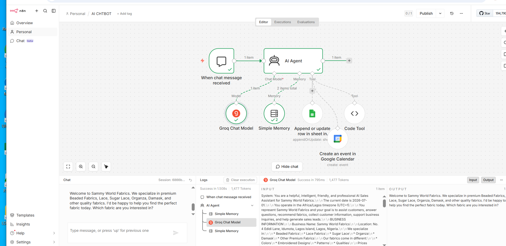

# AI Sales Assistant Chatbot – Sammy World Fabrics

## Overview

The AI Sales Assistant Chatbot is an n8n workflow that helps customers interact with Sammy World Fabrics through an AI-powered conversational assistant. The chatbot answers product questions, qualifies potential customers, remembers previous conversations, records interactions in Google Sheets, and schedules appointments using Google Calendar.

This automation improves customer engagement while reducing manual sales support.

---

## Business Problem

Sales teams often spend significant time answering repetitive customer questions, qualifying leads, and arranging appointments. These manual processes reduce productivity and can delay responses to potential customers.

---

## Solution

This workflow automatically:

- Receives customer messages through the chat interface.
- Uses an AI Agent with Groq to answer questions.
- Remembers previous conversations.
- Records customer interactions in Google Sheets.
- Schedules appointments using Google Calendar when required.

---

## Workflow Overview

The screenshot below shows the actual n8n workflow built for this project.



---

## Technologies Used

- n8n
- Chat Trigger
- AI Agent
- Groq Chat Model
- Simple Memory
- Google Sheets
- Code Tool
- Google Calendar

---

## Workflow

```text
Chat Trigger
      │
      ▼
AI Agent
      │
      ▼
Groq Chat Model
      │
      ▼
Simple Memory
      │
      ▼
Google Sheets
      │
      ▼
Code Tool
      │
      ▼
Google Calendar
```

---

## Business Value

- AI-powered customer support
- Sales lead qualification
- Conversation memory
- Appointment booking
- Improved customer experience

---

## Key Features

- AI chatbot
- Conversation memory
- Lead qualification
- Google Calendar integration
- Automated interaction logging

---

## Future Improvements

- CRM integration
- WhatsApp support
- Voice assistant
- Multi-language support
- Sales analytics dashboard

---

## Author

**Samuel Favour**

AI Automation Specialist

GitHub: https://github.com/SamFavour-Lab
